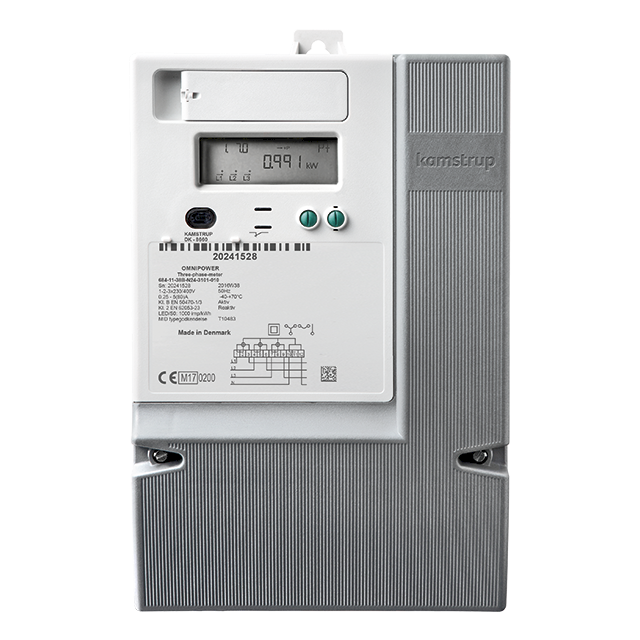

---
hide:
    - navigation # Hide navigation
---

# Mätare

En samling av de mätare som används i Sverige och vart HAN-porten sitter på dem.

## Landis & Gyr E360

HAN-porten på Landis & Gyr E360 sitter under luckan.

## Sagemcom S211

HAN-porten sitter under luckan i nedre vänstra hörnet.

## Kamstrup Omnipower

Har en port för anslutning av olika moduler från Kamstrup som i sin tur erbjuder ett gränssnitt på RJ45, RJ12 eller tillochmed blåtand.

https://www.hemab.se/download/18.7f1416de15b1a8619146261d/1490878150634/OMNIPOWER+3-phase+-+Data+Sheet+-+Svenska.pdf

