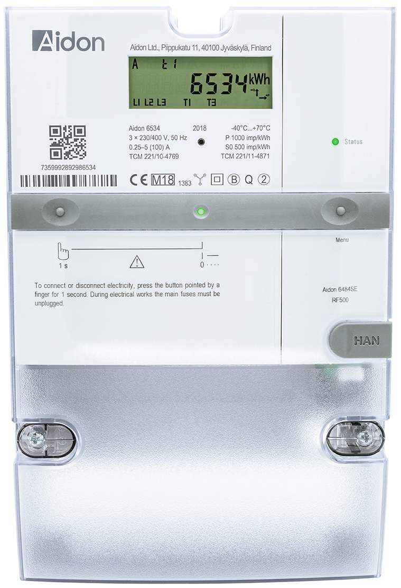
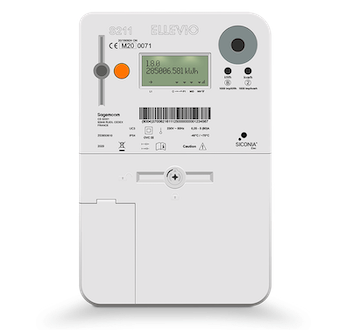
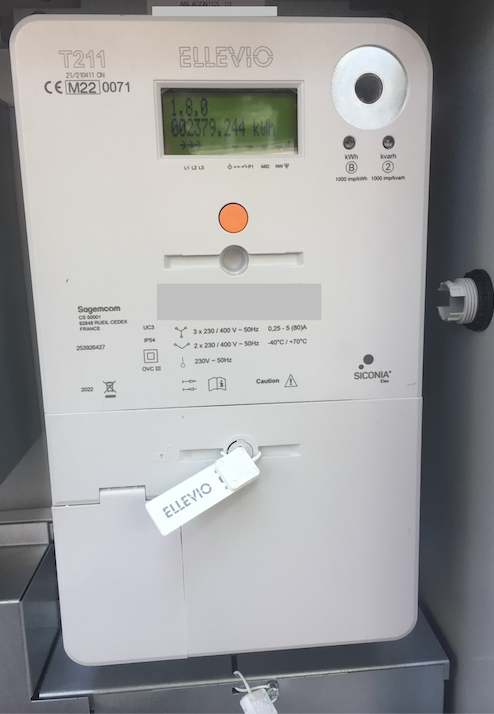

---
hide:
    - navigation # Hide navigation
---

# Mätare

En samling av de mätare som används i Sverige och vart HAN-porten sitter på dem.

## Aidon 6534 

HAN-porten sitter på högra sidan över terminalluckan.

## Landis & Gyr E360

HAN-porten på Landis & Gyr E360 sitter under luckan.

## Iskra AM550

HAN-porten är märkt med P1 och sitter uppe i högra hörnet på mätaren. E.ON kan ej aktivera HAN-porten på denna modell.

## Sagemcom S211

HAN-porten sitter under luckan i nedre vänstra hörnet.

## Sagemcom T211

HAN-porten sitter under luckan i nedre vänstra hörnet.

## Kaifa MA304

HAN-porten sitter under en gummilucka till vänster på mätarens framsida. Det finns både versioner med den svenska och norska standarden ute hos olika elnätsbolag.
